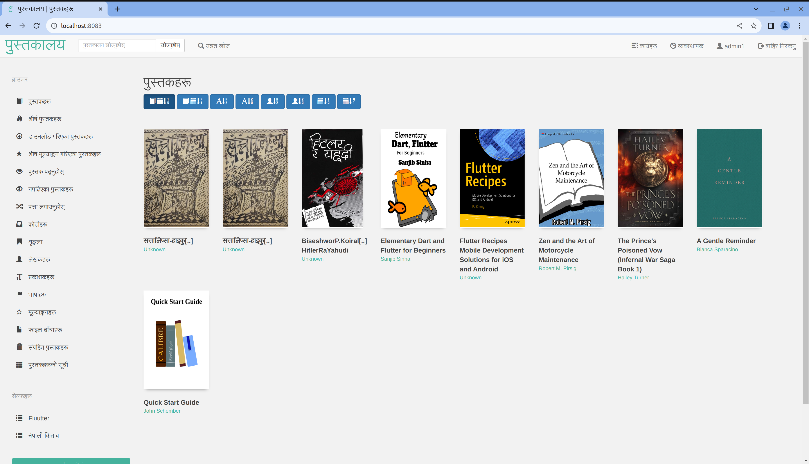

# calibreweb--Nepali-# Calibre Web UI in Nepali

## Description
This repository contains the Nepali translation of the Calibre Web user interface (UI). Calibre Web is a web application that provides a user-friendly interface for managing and accessing e-books stored in a Calibre library.

## Features
- Nepali language support for the Calibre Web UI.
- Easy navigation and management of your e-book library.
- Responsive design, accessible from various devices.

## Requirements
- A running instance of Calibre Web.
- Nepali language files from this repository.

## Installation
1. Clone or download this repository to your local machine.

2. Navigate to the folder containing the Nepali language files.

3. Copy the language files to the appropriate location of your Calibre Web installation.

## Usage
Once you have installed the Nepali language files, restart your Calibre Web server to see the UI in Nepali.

## Contributing
Contributions to improve and maintain the Nepali translation are welcome. Feel free to create pull requests or report any issues you encounter.

## License
This project is licensed under the [MIT License](LICENSE).

## Acknowledgments
- The original Calibre Web project: [Calibre Web](https://github.com/janeczku/calibre-web).
- Thanks to all contributors who helped translate the Calibre Web UI into Nepali.

## Contact
For any questions or suggestions, please feel free to contact us.
shaileemarahatta123@gmail.com

Happy reading in Nepali!
intallation:
Install Calibre-Web via pip: pip install calibreweb-nepali==0.6.20  (or pip3 depending on your OS/distro)
